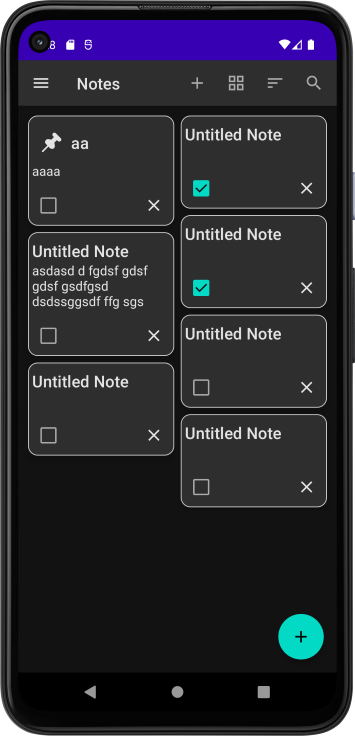

# Demo Note App
Note App that displays a list of Notes. It allows the user to add, delete notes
- Simple app to practice learned compose skills
- Working with state and events in Compose.

## notes
- Not a Codelab, but based on codelabs from developer.android and Phillips Note App
- I have also been looking at other note apps to come up with features I wanna mimic

## Todo
- Adapt for different size screens
- Revisit Top AppBar
- Material Design 3
- Introduce Dagger-Hilt to app DI
- App Icon
- About Screen
- Dark/Light Theme
- add real time Search filter 
- swipe left delete
- Add Search Logic to note list screen 

## Completed
- Introduce Bottom AppBar to at least one screen (edit_note)
- Add icon for notes Search Toggle  
- Introduce Navigation Drawer to app
- DataStore Preferences for sort options
- Grid(StaggeredGrid) / List Toggle
- Add Room DB
- Add Sort, Grid Toggle as action icons in TopBar 
- Order-by and sort list of records 
- Manual DI
- Introduce Sealed Data Class for Events
- Introduce use-cases
- Revisit App package structure. Add Domain package
- At least one validation use case

  
    
    
    
    

Github branches

ref: notes-app-android-kotlin-compose